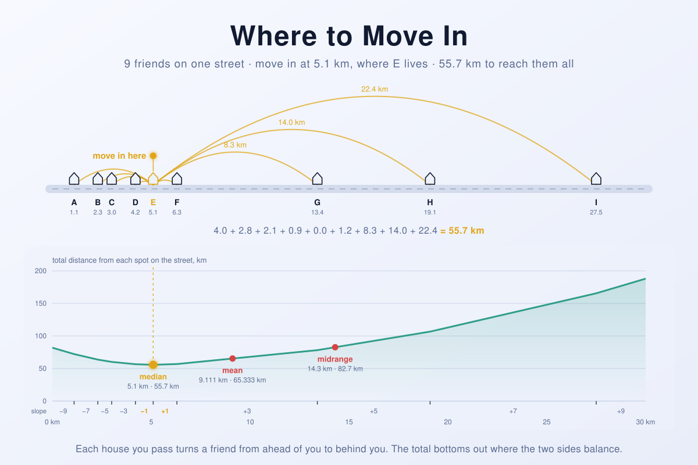

where-to-movein
===============

Nine friends, one long straight street, and a flat to rent somewhere along it.
Where should you live so that visiting all of them costs the fewest kilometres?

The obvious answer is the average of where they live, and it costs almost ten
kilometres more than it needs to. The right answer is the median, the house in
the middle of the list, and the reason fits in a paragraph about pairs of
friends. This repository finds that answer three ways that share no reasoning:
a brute-force walk along the street a metre at a time, a search over the houses
alone, and a sort. Every run holds them against each other and exits non-zero
if they ever disagree. It also scores the mean and the point halfway between the
two end houses, because each of the three "middles" is the right answer to a
different question, and the program shows which question each one wins.

<picture>
  <source media="(prefers-color-scheme: dark)" srcset="docs/banner-dark.svg">
  
</picture>

*(The banner is not decoration: the houses, the trips, the curve, the slopes
under it and every number on it come out of the solver in this repository, so
the picture is the answer.)*

## Problem definition

You have nine friends who live in nine houses along one straight street.
Measured from the left end of the street, the houses stand at:

| House | Distance |
| --- | --- |
| A | 1.1 km |
| B | 2.3 km |
| C | 3.0 km |
| D | 4.2 km |
| E | 5.1 km |
| F | 6.3 km |
| G | 13.4 km |
| H | 19.1 km |
| I | 27.5 km |

On which kilometre of the street, counting from the left, should you rent a flat
to minimise the sum of the distances to all your friends? In other words, find
the point `X` for which

```
dist(A, X) + dist(B, X) + … + dist(I, X)
```

is smallest, where `dist(P, X) = |P − X|`.

Nothing depends on there being nine friends, or on these nine positions. The
program takes any street on the command line.

## Requirements

**Java 17 or newer.** It is compiled against the Java 17 API with
`javac --release 17` and tested on Homebrew's OpenJDK 21. No Maven, no Gradle,
no jar, no dependencies outside `java.base`. There is nothing to build:

```
java WhereToMoveIn.java
```

Java has been able to compile and run a single source file in one step since
Java 11 ([JEP 330](https://openjdk.org/jeps/330)), which suits a repository
that is one file. `javac` is only needed if you want the `.class` files.

Older releases are not supported. The program uses records, `switch`
expressions with arrow labels, text blocks and `Stream.toList()`. All of those
landed by Java 16, but Java 17 is the first long-term-support release that has
the whole set, so that is the floor.

**On macOS**, `/usr/bin/java` is a stub that only knows how to tell you no JDK
is installed. Homebrew's is the easiest fix:

```
brew install openjdk@21
export PATH="/opt/homebrew/opt/openjdk@21/bin:$PATH"
```

That formula is keg-only: it installs nothing system-wide and needs no
password. If you would rather have a JDK that every terminal finds without a
`PATH` entry, `brew install --cask temurin@21` installs one properly, at the
cost of an admin prompt.

## Running it

```
java WhereToMoveIn.java                          # the puzzle above
java WhereToMoveIn.java 1.1 2.3 3.0 4.2          # your own street, in km
java WhereToMoveIn.java Ann=2 Bob=2 Cy=9.25      # with names
java WhereToMoveIn.java --random 50 --seed 7 -q  # fifty houses at random
```

Options:

| Flag | Meaning |
| --- | --- |
| `house …` | Positions in km from the left end, as `KM` or `NAME=KM` (default: the puzzle). |
| `-r N`, `--random N` | `N` houses at random instead, on a 100 m grid. |
| `-l KM`, `--length KM` | Street length for `--random` (default: `30`). |
| `-s S`, `--seed S` | Seed for `--random` (default: `2026`). |
| `-q`, `--quiet` | Skip the table of houses. |
| `-h`, `--help` | Show usage. |

Positions are read exactly, to the metre: `27.5` is 27,500 metres, and
`1.0001` is refused rather than rounded. The tables go to **stdout** and the
summary lines go to **stderr**, so the results stay easy to pipe somewhere else.
The exit code carries the verdict: `0` every method agrees and the answer checks
out, `1` a cross-check failed, `2` the command line was wrong.

```
$ java WhereToMoveIn.java
9 houses between 1.1 km and 27.5 km, from the puzzle in README.md.
house        lives at  distance from 5.1 km
A              1.1 km                4.0 km
B              2.3 km                2.8 km
C              3.0 km                2.1 km
D              4.2 km                0.9 km
E              5.1 km                0.0 km
F              6.3 km                1.2 km
G             13.4 km                8.3 km
H             19.1 km               14.0 km
I             27.5 km               22.4 km
total                               55.7 km

method                        best spot   total distance       time
-------------------------------------------------------------------
scan every metre                 5.1 km          55.7 km      1.9ms
try every house                  5.1 km          55.7 km      0.0ms
median                           5.1 km          55.7 km      0.2ms

middle            where   total distance       sum of squares     farthest house
----------------------------------------------------------------------------------
median         5.100 km        55.700 km *        797.150 km²          22.400 km
mean           9.111 km        65.333 km          652.349 km² *        18.389 km
midrange      14.300 km        82.700 km          894.670 km²          13.200 km *
* the lowest in its column
move in at 5.1 km, where E lives: 55.7 km to all 9 houses.
3 independent methods agree on it.
the mean, at 9.111 km, would cost 9.633 km more (+17.3%); the midrange, at 14.300 km, would cost 27.000 km more (+48.5%).
```

## The answer, and why

**Move in at 5.1 km, where E lives. The nine trips add up to 55.7 km, and
nowhere else on the street does as well.**

The quickest way to see it is to pair the friends off from the outside in. A and
I live 26.4 km apart. From anywhere between their two houses, reaching both of
them costs exactly 26.4 km, however you split it; from anywhere outside, it
costs more. The same goes for B and H (16.8 km), C and G (10.4 km), and D and F
(2.1 km). E is left over. So every spot on the street pays at least
26.4 + 16.8 + 10.4 + 2.1 = **55.7 km** for the four pairs, plus its own distance
to E. A spot between D and F is inside all four pairs and pays exactly 55.7 km
for them, and of those spots only E's doorstep adds nothing for E. That is the
whole proof. Where the answer lands depends on the order of the houses, not on
how far apart they are.

The same fact looks different from the pavement. Stand anywhere and take one
step to the right. You are now a step closer to every friend ahead of you and a
step further from every friend behind you, so the total changes by
*(behind − ahead)* per kilometre walked. At the left end all nine friends are
ahead and the total falls at 9 km per km. Every house you pass moves one friend
from ahead to behind, and the slope goes up by two: −9, −7, −5, −3, −1, and then,
past E, +1, +3, +5, +7, +9. The total stops falling at the one place where the
slope stops being negative, which is at E, with four friends on either side.
That row of slopes runs along the bottom of the banner.

It is also an argument about voting. Stand anywhere other than E and a majority
of the friends would like you to move the same way, so any other spot loses a
vote against its neighbour. Francis Galton made exactly that case for the median
in 1907: "Every other estimate is condemned by a majority of voters as being
either too high or too low, the middlemost alone escaping this condemnation."

Two consequences are worth running.

**Only the order matters.** Move I from 27.5 km to 2,750 km, a hundred times
further out, and the answer does not move:

```
$ java WhereToMoveIn.java -q A=1.1 B=2.3 C=3.0 D=4.2 E=5.1 F=6.3 G=13.4 H=19.1 I=2750
...
move in at 5.1 km, where E lives: 2,778.2 km to all 9 houses.
3 independent methods agree on it.
the mean, at 311.611 km, would cost 2,098.578 km more (+75.5%); the midrange, at 1,375.550 km, would cost 9,546.150 km more (+343.6%).
```

The trips get longer, because I is further away, but the best spot is still
E's. The mean has chased I out to 311.6 km. The answer only changes when E moves
or a friend crosses from one side of E to the other, and to drag it as far as I
dragged the mean, you would have to move five of the nine friends.

**An even number of friends gives a whole stretch of street.** Leave I out and
the eight that remain have four on each side of anywhere between D and E. The
slope there is zero, and every spot in that 900 m stretch is exactly as good:

```
$ java WhereToMoveIn.java -q A=1.1 B=2.3 C=3.0 D=4.2 E=5.1 F=6.3 G=13.4 H=19.1
...
move in anywhere from 4.2 km (D) to 5.1 km (E): 33.3 km to all 8 houses, wherever you pick.
```

So an answer here is a stretch, `from` to `to`, which happens to be a single
point when the count is odd. The 2013 version could only ever report one point;
[History](#history) has the one it chose.

## Three middles, three questions

"The middle" of a set of numbers means at least three different things, and each
one is the best possible answer to a different question about the trips:

| Middle | Where | Total distance | Sum of squares | Farthest friend |
| --- | --- | --- | --- | --- |
| median | 5.100 km | **55.700 km** | 797.150 km² | 22.400 km |
| mean | 9.111 km | 65.333 km | **652.349 km²** | 18.389 km |
| midrange | 14.300 km | 82.700 km | 894.670 km² | **13.200 km** |

The winners fall on the diagonal, and they always will: the program fails the
run if they ever do not.

**The median** minimises the total distance, which is this puzzle's question.

**The mean** minimises the sum of *squared* distances. That is what an average
is for: it is the least-squares answer, and it is what you want when a long trip
is disproportionately worse than two short ones. Squaring is also why it is so
easily pulled around. I lives 22.4 km from E, which squared is 501.76 km², more
than half of the median's whole 797.15. The mean sits 4 km to the right of the
median, towards G, H and I, to bring those squares down, and pays for it in
total distance.

**The midrange**, halfway between A and I, minimises the distance to the
*farthest* friend: 13.2 km, against 22.4 km from the median. It is the answer if
what you care about is the worst trip. It looks at two of the nine houses and
ignores the other seven entirely.

They are one family. Minimise the sum of the distances raised to a power `p`:
at `p = 1` the answer is the median, at `p = 2` it is the mean, and as `p` grows
the farthest friend comes to dominate everything and the answer slides to the
midrange. Dunham Jackson worked through the limits in 1921.

Which one is "right" depends entirely on what you are trying to minimise. The
puzzle asks for the total, so the answer is the median. At that question the
mean costs 17.3% more and the midrange 48.5% more, and the median loses both of
the other questions.

## Other ways to solve it

**1. Walk the street.** *(`scan every metre`)* Add up all nine distances at
every metre from 0 to 27.5 km and keep the lowest: 27,501 spots × 9 houses =
247,509 distances, about two milliseconds. It assumes nothing about the shape of
the answer, which is exactly why it is here, as the referee. It only works
because the houses sit on a whole-metre grid: a scan finds the best grid point,
which is the best point overall only when every house is on the grid too.

**2. Try only the houses.** *(`try every house`)* Between two neighbouring
houses nobody changes sides, so the total is a straight line there. The whole
curve is a chain of straight lines with a corner at every house, and a chain of
straight lines bottoms out at a corner. So only the nine houses need trying:
`n²` distances instead of `n × L`, where `L` is the street's length in metres.

**3. Sort, and take the middle.** *(`median`)* `O(n log n)`, and the total comes
free from the pairing argument, as the sum of the gaps between the outermost
pair, the next pair in, and so on.

**4. Take the middle without sorting.** Finding the median does not need the
whole list in order, only the one element that would land in the middle.
Quickselect does that in expected linear time, and the median-of-medians
algorithm does it in guaranteed linear time. Not implemented, for the honest
reason that sorting nine numbers is not the bottleneck of anything.

**5. Search the curve.** The total distance is convex, so it has one valley and
no false bottoms. Ternary or golden-section search closes in on it by
evaluating the total at a few well-chosen spots, and bisecting on the sign of
the slope does the same by counting friends on each side, which quietly turns
back into finding the median.

**6. Make it a linear program.** Minimise `t₁ + … + tₙ` subject to
`tᵢ ≥ x − hᵢ` and `tᵢ ≥ hᵢ − x`. Any LP solver returns `x = 5.1`. This is the
formulation that generalises to fitting a line by least absolute deviations,
which is the same puzzle with a slope added.

**7. Weight the friends.** If you visit some friends more often than others,
give each a weight: how many trips a week. Every house you pass now changes the
slope by twice its weight instead of by two, and the answer is the *weighted*
median, the spot where you have passed half the total weight. Same argument,
same one pass after a sort.

### If the street is not a street

**A city grid.** With Manhattan distances, east–west and north–south travel add
up independently. Take the median of the x-coordinates and, separately, the
median of the y-coordinates.

**Open country.** With straight-line distances there is no such shortcut. The
point minimising the total is the *geometric median*, or Fermat–Weber point, and
in general it has no closed form. For three friends it is Fermat's problem, with
a classical geometric construction. For more, Weiszfeld's 1937 iteration walks
towards it.

**A road network.** On a network of roads there is always a best spot at a
junction or a house, which is the network version of "only try the houses".
That is Hakimi's theorem. On a network with no loops, a tree, the answer is the
place where no branch leads to more than half of the friends: the median again,
in another form.

**Several flats.** Choosing `p` spots so that everyone's trip to the *nearest*
one is short in total is the `p`-median problem. It is NP-hard on general
networks, but on a line or a tree it yields to dynamic programming.

### If you did want it to scale

```
$ java WhereToMoveIn.java --random 100000 -q
100,000 houses between 0.0 km and 30.0 km, placed at random along 30.0 km with seed 2026.
scan every metre skipped: it would add up more than 200,000,000 distances.
try every house skipped: it would add up more than 200,000,000 distances.
method                        best spot   total distance       time
-------------------------------------------------------------------
median                          15.0 km     755,346.3 km      2.1ms
...
only the median could run at this size; it is certified by the metre either side.
```

The two brute-force methods decline past two hundred million distances. The
median does not care, and neither does its certificate. The total distance is
convex, so a stretch of street whose two ends both score the claimed total, and
which climbs a metre further out on each side, cannot be beaten anywhere. That
is four more sums of `n` distances, and it holds the median to account even when
nothing else can run.

If friends arrive one at a time and you want the best spot after each arrival,
keep the lower half of the street in a max-heap and the upper half in a
min-heap. The median is on top of one of them, and each arrival costs
`O(log n)`.

## Checking it

There is no test suite. There are three methods that must agree, and on a
problem like this that is worth more. Every run also checks:

- that the total each method claims is what the distances from its spot really
  add up to;
- that the answer climbs a metre further out on both sides, the convexity
  certificate above;
- that none of the other middles beats the optimum;
- and that each middle wins its own column in the table.

Any failure prints a `FAIL:` line and exits `1`. Random streets make it easy to
lean on all of that at once:

```sh
for seed in $(seq 1 40); do for n in 1 2 3 4 8 9 10 31 64 101; do
  java WhereToMoveIn.java --random $n --seed $seed -q >/dev/null 2>&1 || echo "FAIL n=$n seed=$seed"
done; done
```

Odd counts, even counts, one house, and friends sharing a spot all come up.
Deliberately breaking any one method, by taking the wrong middle element for an
even count, stopping the scan a metre short, or adding a metre to the median's
total, makes some of those runs fail.

## History

The first version, in 2013, was a single `src/Houses.java`: nine
`static final double` constants, a `testF` with nine copy-pasted lines and a
Polish accumulator called `suma_odleglosci`, and a `main` that stepped a
`double` from 0 to 1000 km in increments of `0.001`, keeping the lowest total it
saw. It printed:

```
perfect place found: 5.100000000000038
min(E^dist) found: 55.70000000000004
```

**It got the right answer.** The rest of this section is about everything it
did on the way.

**The counter drifted.** `0.001` has no exact binary representation, so every
addition rounded, and the rounding piled up. After a million additions the
counter stood at `999.9999999832651`, still under `1000`, so the loop ran
**1,000,001** times, one more than it meant to. The drift peaked at
`1.67 × 10⁻⁸` km, about seventeen micrometres. That is harmless for the answer,
and the same drift is where the trailing `38` in `5.100000000000038` comes from.

**97% of the search was past the last house.** I lives at 27.5 km, and the scan
ran on to 1,000 km: 972,500 of its million spots were ones where every step
right is a step away from everybody.

**It could only report one point.** With an even number of friends the best
spot is a stretch, and the program had no way to say so. Run on the eight
friends without I, where everything from 4.2 to 5.1 km is equally good, it
printed `4.200999999999738`. Even that choice was made by rounding: at the step
meant to be exactly D, the drifting counter stood at `4.199999999999737`, a hair
short of D and still on the downslope. So it reported the next step instead, one
point out of a 900-metre stretch that was all equally good, with no mention of
the rest.

**Nothing checked it.** There was one method and nothing to compare it with. The
label `min(E^dist)` did not help anyone reading the output either.

The 2026 rewrite keeps the program's shape (one file, no build) and its original
idea, the scan, as the referee. Positions became whole metres in `int`s, so
nothing can drift. The street became a command-line argument instead of nine
constants. Two more methods joined that share no reasoning with the scan, plus
the convexity certificate, the comparison with the other middles, answers that
can be a stretch rather than a point, and exit codes. The file moved to the root
as `WhereToMoveIn.java`, which runs as it stands with `java WhereToMoveIn.java`.

## Literature

The puzzle is small, but the fact under it, that the middle value minimises the
total distance, is old, and it has turned up in statistics, voting, economics and
the siting of factories and telephone exchanges.

**Where the median comes from.** Pierre-Simon Laplace's 1774 memoir on inverse
probability shows that the posterior median is the estimate that minimises the
expected absolute error. It is available in English as Stephen M. Stigler,
["Laplace's 1774 Memoir on Inverse Probability"](https://doi.org/10.1214/ss/1177013620),
*Statistical Science* **1**(3), 1986, 359–378. Roger Boscovich fitted lines to
measurements of the Earth's shape by least absolute deviations in 1757 and 1760,
and Laplace recast the method so that its solution is a weighted median
(*Mécanique céleste*, 1799). An explicit proof that the middle value of a set
of numbers minimises the sum of absolute deviations is Gustav Theodor
Fechner's: "Ueber den Ausgangswerth der kleinsten Abweichungssumme, dessen
Bestimmung, Verwendung und Verallgemeinerung", *Abhandlungen der
mathematisch-physischen Classe der Königlich Sächsischen Gesellschaft der
Wissenschaften* **11**(1), 1874, 1–76. He calls it the *Centralwerth* and says
he knows of no one who had asked the question before him. The story is told in
Stephen M. Stigler, *The History of Statistics: The Measurement of Uncertainty
before 1900*, Belknap Press of Harvard University Press, 1986, and Anders Hald,
*A History of Mathematical Statistics from 1750 to 1930*, Wiley, 1998.

**One family of middles.** Dunham Jackson,
["Note on the Median of a Set of Numbers"](https://doi.org/10.1090/S0002-9904-1921-03379-9),
*Bulletin of the American Mathematical Society* **27**(4), 1921, 160–164,
minimises the sum of the `p`-th powers of the distances and lets `p` approach 1.
The minimiser converges to the median, which settles the even case with a
particular point between the middle two. That point is not their midpoint in
general. As `p` grows without bound, the minimiser tends to the midrange.

**The democratic middle.** Francis Galton,
["One Vote, One Value"](https://doi.org/10.1038/075414a0), *Nature* **75**, 1907,
414, argues that when a group has to settle on a single number, the median of
its members' estimates is the one to adopt, because every other one is outvoted.
A week later, Galton, ["Vox Populi"](https://doi.org/10.1038/075450a0),
*Nature* **75**, 1907, 450–451, tried it on the 787 usable entries in a
competition to guess the weight of an ox at a livestock show. The median was
1,207 lb, against an actual dressed weight of 1,198 lb. Duncan Black,
["On the Rationale of Group Decision-making"](https://doi.org/10.1086/256633),
*Journal of Political Economy* **56**(1), 1948, 23–34, turned the same argument
into the median voter theorem. Harold Hotelling,
["Stability in Competition"](https://doi.org/10.2307/2224214), *The Economic
Journal* **39**(153), 1929, 41–57, put two competing sellers on a line, "Main
Street in a town or a transcontinental railroad", which is this puzzle's street
with a rival added. The ice-cream sellers on a beach came later.

**Location theory.** The two-dimensional version is usually credited to Alfred
Weber, *Ueber den Standort der Industrien. Erster Teil: Reine Theorie des
Standorts*, J. C. B. Mohr (Paul Siebeck), Tübingen, 1909, with a mathematical
appendix by Georg Pick. It is in English as *Alfred Weber's Theory of the
Location of Industries*, translated by Carl Joachim Friedrich, University of
Chicago Press, 1929. The three-point case is much older: Fermat posed it in the
first half of the seventeenth century, Torricelli solved it, and Viviani
published the solution in 1659. The standard iterative method is E. Weiszfeld
(later Andrew Vázsonyi), "Sur le point pour lequel la somme des distances de n
points donnés est minimum", *Tôhoku Mathematical Journal* **43**, 1937, 355–386.
It is in English, annotated, as E. Weiszfeld and Frank Plastria,
["On the point for which the sum of the distances to n given points is minimum"](https://doi.org/10.1007/s10479-008-0352-z),
*Annals of Operations Research* **167**, 2009, 7–41. Harold W. Kuhn,
["A note on Fermat's problem"](https://doi.org/10.1007/BF01584648),
*Mathematical Programming* **4**, 1973, 98–107, analysed its convergence. His
claim was shown to need qualification by R. Chandrasekaran and A. Tamir,
["Open questions concerning Weiszfeld's algorithm for the Fermat–Weber location problem"](https://doi.org/10.1007/BF01587094),
*Mathematical Programming* **44**, 1989, 293–295.

**On networks.** S. Louis Hakimi,
["Optimum Locations of Switching Centers and the Absolute Centers and Medians of a Graph"](https://doi.org/10.1287/opre.12.3.450),
*Operations Research* **12**(3), 1964, 450–459, proves that a best spot on a
network can always be found at a vertex. A. J. Goldman and C. J. Witzgall,
["A Localization Theorem for Optimal Facility Placement"](https://doi.org/10.1287/trsc.4.4.406),
*Transportation Science* **4**(4), 1970, 406–409, and A. J. Goldman,
["Optimal Center Location in Simple Networks"](https://doi.org/10.1287/trsc.5.2.212),
*Transportation Science* **5**(2), 1971, 212–221, give the half-the-weight rule
for trees. On a path, Goldman's procedure is to add up the weights from one end
until they reach half the total, which is this puzzle with weighted friends.
O. Kariv and S. L. Hakimi,
["An Algorithmic Approach to Network Location Problems. II: The p-Medians"](https://doi.org/10.1137/0137041),
*SIAM Journal on Applied Mathematics* **37**(3), 1979, 539–560, show that
placing `p` facilities is NP-hard on general networks and polynomial on trees.
For the field as a whole, see Zvi Drezner and Horst W. Hamacher (eds.),
[*Facility Location: Applications and Theory*](https://doi.org/10.1007/978-3-642-56082-8),
Springer, 2002, whose first chapter is on the Weber problem. Richard L. Francis,
Leon F. McGinnis Jr. and John A. White, *Facility Layout and Location: An
Analytical Approach*, 2nd ed., Prentice Hall, 1992, is a standard textbook.

**Finding the middle fast.** C. A. R. Hoare,
["Algorithm 65: Find"](https://doi.org/10.1145/366622.366647), *Communications
of the ACM* **4**(7), 1961, 321–322, is quickselect. Manuel Blum, Robert W.
Floyd, Vaughan Pratt, Ronald L. Rivest and Robert E. Tarjan,
["Time Bounds for Selection"](https://doi.org/10.1016/S0022-0000(73)80033-9),
*Journal of Computer and System Sciences* **7**(4), 1973, 448–461, make it
linear in the worst case. The weighted median, including this puzzle as the
"post-office location problem" and its Manhattan-grid version, is Problem 9-2 in
Thomas H. Cormen, Charles E. Leiserson, Ronald L. Rivest and Clifford Stein,
*Introduction to Algorithms*, 3rd ed., MIT Press, 2009. For searching a
one-valley curve by evaluating it at chosen points, see J. Kiefer,
["Sequential Minimax Search for a Maximum"](https://doi.org/10.1090/S0002-9939-1953-0055639-3),
*Proceedings of the American Mathematical Society* **4**(3), 1953, 502–506.

## License

Released into the public domain (the Unlicense) — see [LICENSE](LICENSE).
